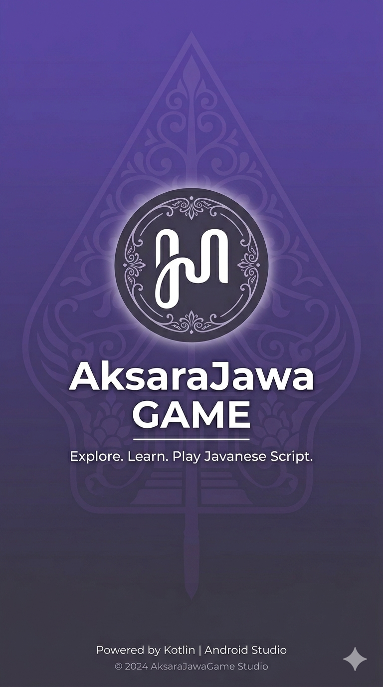

<div align="center">
  
  <h1 align="center">JavaQuest</h1>
  <p align="center">
    <strong>Belajar Aksara Jawa Jadi Seru & Menyenangkan</strong>
    <br>
    Game edukasi interaktif untuk mempelajari aksara Jawa (Ha Na Ca Ra Ka)
    <br>
    berbasis Android dengan Kotlin & Jetpack Compose
  </p>
  <p>
    
    
    
    
    
    
  </p>
</div>

---

## 📖 Tentang JavaQuest

**JavaQuest** adalah game edukasi Android yang dirancang untuk membantu siapa saja -- dari anak-anak hingga dewasa -- belajar **Aksara Jawa** (Hanacaraka) dengan cara yang interaktif dan menyenangkan. 

Aksara Jawa adalah sistem tulisan tradisional yang digunakan untuk menulis bahasa Jawa, memiliki keindahan dan nilai budaya yang tinggi. Namun, minat dan kemampuan membaca aksara Jawa semakin menurun di era digital. **JavaQuest hadir untuk menjembatani kesenjangan ini** melalui pendekatan gamifikasi yang modern.

### ✨ Fitur Utama

| Fitur | Deskripsi |
|---|---|
| 🎮 **3 Tingkat Kesulitan** | Mudah (aksara dasar), Sedang (aksara + sandhangan), Sulit (drag-and-drop puzzle) |
| 📚 **Kamus Aksara Lengkap** | 20 aksara dasar, sandhangan vokal, aksara murda, rekan, swara, dan angka Jawa |
| 🔥 **Leaderboard Real-time** | Bersaing dengan pemain lain secara langsung via Firebase |
| 👤 **Profil & Avatar** | Profil pengguna dengan upload foto dari galeri |
| ❤️ **Sistem Nyawa** | 3 nyawa per game -- jawab salah, nyawa berkurang! |
| 🏆 **Skor & Riwayat** | Skor otomatis tersimpan, lihat kemajuan belajarmu |
| 🎨 **Animasi Menarik** | Efek particle, animasi jatuh, dan transisi halus |

---

## 🎯 Gameplay

### Mudah (Easy)
10 soal pilihan ganda. Kamu akan melihat sebuah aksara Jawa, lalu memilih padanan latin yang benar. Cocok untuk pemula yang baru mengenal aksara dasar.

### Sedang (Medium)
10 soal pilihan ganda dengan tingkat kesulitan lebih tinggi. Menggabungkan aksara dasar dengan **sandhangan vokal** (i, u, e, o, ê).

### Sulit (Hard)
Mode **drag-and-drop**! Kamu diberikan sebuah kata dalam latin, lalu harus menyusun aksara Jawa yang benar dengan memilih dan mengurutkan karakter yang tersedia. Soal diambil langsung dari database Firebase.

---

## 📸 Tangkapan Layar

<details>
<summary>Klik untuk melihat tangkapan layar</summary>

| | | |
|---|---|---|
|  |  |  |
| Splash Screen | Home Screen | Game Screen |

</details>

---

## 🧱 Tech Stack

### Bahasa & Framework
- **Kotlin** 2.1.0 -- Bahasa utama
- **Jetpack Compose** -- UI deklaratif modern (Material Design 3)
- **Navigation Compose** 2.8.5 -- Navigasi antar layar
- **ViewModel + LiveData** -- Arsitektur MVVM

### Backend & Database
- **Firebase Authentication** -- Login/register dengan email & password
- **Firebase Realtime Database** -- Menyimpan profil pengguna, leaderboard, dan soal
- **Firebase Storage** -- Upload avatar pengguna

### Library Pendukung
| Library | Fungsi |
|---|---|
| `coil-compose` 2.7.0 | Loading gambar头像 |
| `kotlinx-serialization` 1.7.3 | Serialisasi JSON |
| `WorkManager` 2.10.0 | Notifikasi background |
| `Material Icons Extended` | Ikon-ikon Material Design |

---

## 🏗️ Arsitektur

```
com.example.aksarajawa
├── MainActivity.kt          # Entry point utama
├── Navigation.kt            # Rute navigasi (12 screen)
├── Models.kt                # Data class & daftar aksara
├── Theme.kt                 # Tema Material 3 (warna, tipografi, shape)
│
├── GameViewModel.kt         # ViewModel utama (MVVM)
├── GameRepository.kt        # Repository Firebase (auth, profil, leaderboard)
├── FirebaseRepository.kt    # Repository Firebase pendukung
├── SupabaseClient.kt        # Placeholder (sudah tidak dipakai)
│
├── Screens                  # 12 Screen Composables
│   ├── SplashScreen.kt
│   ├── LoginScreen.kt
│   ├── RegisterScreen.kt
│   ├── HomeScreen.kt
│   ├── GameScreen.kt        # Mudah & Sedang
│   ├── HardGameScreen.kt    # Sulit (drag-and-drop)
│   ├── ResultScreen.kt
│   ├── ProfileScreen.kt
│   ├── LeaderboardScreen.kt
│   ├── AboutScreen.kt
│   ├── DictionaryScreen.kt
│   └── DictionaryDetailScreen.kt
│
├── Components.kt            # Komponen UI bersama
└── NotificationHelper.kt    # Helper notifikasi
```

---

## 🚀 Cara Menjalankan

### Prasyarat
- Android Studio Ladybug (2024.2.1) atau lebih baru
- JDK 17+
- Perangkat Android API 24+ (Android 7.0 Nougat) atau emulator
- Koneksi internet (untuk Firebase)

### Langkah-langkah
1. **Clone repositori**
   ```bash
   git clone https://github.com/kyunnro/Jawa-Quest.git
   ```

2. **Buka di Android Studio**
   - File → Open → Pilih folder `Jawa-Quest`
   - Tunggu Gradle sync selesai

3. **Konfigurasi Firebase**
   - Buka [Firebase Console](https://console.firebase.google.com)
   - Buat project baru (atau gunakan yang sudah ada)
   - Aktifkan **Authentication** (Email/Password)
   - Aktifkan **Realtime Database** (buat dengan aturan `test mode`)
   - Aktifkan **Storage**
   - Download `google-services.json` dan letakkan di folder `app/`
   
4. **Jalankan**
   - Pilih perangkat/emulator
   - Klik **Run** atau tekan `Shift + F10`

---

## 🗺️ Roadmap

- [x] Sistem login/register dengan email
- [x] 3 mode permainan (Mudah, Sedang, Sulit)
- [x] Leaderboard real-time
- [x] Profil pengguna & avatar
- [x] Kamus aksara Jawa
- [ ] Dark mode
- [ ] Soal tidak terbatas (procedural generation)
- [ ] Multiplayer real-time
- [ ] Achievement & badge system
- [ ] Dukungan bahasa Inggris
- [ ] Versi iOS (KMM)

---

## 📄 Lisensi

Distributed under the MIT License. See `LICENSE` for more information.

---

<div align="center">
  Dibuat dengan ❤️ untuk melestarikan budaya Jawa
  
  <br>
  
  **"Sabda pandhita ratu, mulang marang putra wayah, aja nganti ilang kabudhayan Jawa."**
</div>
